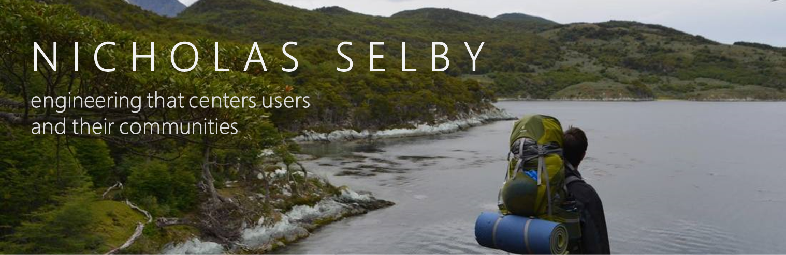

I am the VP of Engineering at Renewvia Energy. I am responsible for the design, procurement, construction, productive use, and software infrastructure of solar minigrids in rural Kenya, Nigeria, and Ethiopia. I have a B.S. in Mechanical Engineering from the Georgia Institute of Technology, an M.S. in Mechanical Engineering from MIT, and a Ph.D. in Electrical Engineering and Computer Science from MIT. I have worked as a research engineer for NASA's Jet Propulsion Laboratory and Sandia National Laboratories.

Some of my favorite technologies include robotics and machine learning with **PyTorch,** **ROS,** and **NumPy** in **Python;** computer vision with **OpenCV** in **C++;** and full-stack web development with **HTML,** **CSS,** and **JavaScript**'s **Node,** **Express,** and **Vue** tools. I'm also adept at **MATLAB and Simulink,** **LabVIEW,** and **Java.** I'm passionate about sharing these skills with the next generation of engineers and scientists, and I've had the honor of teaching computer science around the world.

## Find me around the web 🌎
- [My Personal Website](https://rupumped.github.io/)
- [LinkedIn](https://www.linkedin.com/in/nicholas-selby-5278b334/)
- [Google Scholar](https://scholar.google.com/citations?user=SKcs1pEAAAAJ)